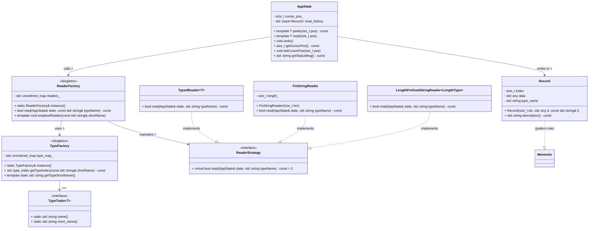

+++
date = '2025-05-25T21:20:23+08:00'
draft = false
title = 'C++设计模式一'
categories = ["C++", "design pattern"]
tags = ["单例模式", "工厂模式", "策略模式", "备忘录模式"]
+++

# C++ 二进制阅读器设计模式总结

本文从设计模式角度对一个基于 C++ 的二进制数据阅读器核心模块进行拆解和归纳，详细介绍了如何通过单例、工厂、策略、备忘录、模板与类型特征等模式，使得代码在扩展性、可维护性和灵活性方面达到最优。文末附有一张可在 GitHub 上直接渲染的 Mermaid 类图，帮助直观理解各模块之间的关系。

---

## 目录

1. [设计模式概览](#设计模式概览)
   1.1 [单例模式（Singleton）](#单例模式singleton)
   1.2 [工厂模式（Factory）](#工厂模式factory)
   1.3 [策略模式（Strategy）](#策略模式strategy)
   1.4 [备忘录模式（Memento）](#备忘录模式memento)
   1.5 [模板与类型特征（Template & Traits）](#模板与类型特征template--traits)
2. [各模块与模式对应关系](#各模块与模式对应关系)
3. [Mermaid 类图](#mermaid-类图)
4. [整体架构与总结](#整体架构与总结)

---

## 设计模式概览

### 单例模式（Singleton）

* **意图**：保证一个类只有一个实例，并提供一个全局访问点。
* **应用场景**：全局类型注册器、全局读取器工厂等需要共享状态的场景。

在本项目里，以下两个类被设计为单例：

1. `TypeFactory`：维护“类型名称（如 `"u8"`、`"i16"`）→ `std::type_index`”的映射。
2. `ReaderFactory`：维护“读取类型名称（如 `"u8"`、`"string@u8"`）→ 对应的 `ReaderStrategy` 实例” 的映射。

典型实现示例：

```cpp
// TypeFactory.hpp
class TypeFactory {
public:
  static TypeFactory& instance() {
    static TypeFactory inst;  // 局部静态变量，C++11 及以后保证线程安全
    return inst;
  }

  // 删除拷贝/赋值操作符，防止复制
  TypeFactory(const TypeFactory&) = delete;
  TypeFactory& operator=(const TypeFactory&) = delete;

  std::type_index getTypeIndex(const std::string& shortName) const { … }
  template<typename T> static std::string getTypeShortName() { return TypeTraits<T>::short_name(); }
  // …

private:
  TypeFactory();   // 私有构造，内部完成所有类型注册
  ~TypeFactory();  // 私有析构
  std::unordered_map<std::string, std::type_index> type_map_;
};
```

```cpp
// ReaderFactory.hpp
class ReaderFactory {
public:
  static ReaderFactory& instance() {
    static ReaderFactory inst;  // 同样利用局部静态变量保证线程安全
    return inst;
  }

  // 删除拷贝/赋值操作符
  ReaderFactory(const ReaderFactory&) = delete;
  ReaderFactory& operator=(const ReaderFactory&) = delete;

  bool read(AppState& state, const std::string& typeName) const {
    auto it = readers_.find(typeName);
    if (it != readers_.end()) {
      return it->second->read(state, typeName);
    }
    return false;
  }

private:
  ReaderFactory();  // 私有构造，内部注册所有 ReaderStrategy
  ~ReaderFactory();
  std::unordered_map<std::string, std::unique_ptr<ReaderStrategy>> readers_;

  template<typename T>
  void emplaceReader(const std::string& shortName) {
    readers_.emplace(shortName, std::make_unique<TypedReader<T>>());
  }
};
```

* **要点**

  1. 私有构造/析构、删除拷贝与赋值，确保只能通过 `instance()` 获取实例。
  2. C++11 后，局部静态变量的初始化线程安全，无需额外加锁。
  3. 单例中持有全局共享的数据（如映射表），只会被创建一次，降低运行时开销。

---

### 工厂模式（Factory）

* **意图**：将对象的创建与使用解耦，让“谁来创建对象”和“如何创建对象”的逻辑全部集中到一个或几个工厂类里。
* **应用场景**：

  * 新增或修改支持的基础类型时，只需在工厂里注册/修改相关逻辑；
  * 客户端无需直接 `new` 某个类型，而是统一通过“类型名称 → 工厂”来获取实例。

#### 1.2.1 TypeFactory

* 作用：完成“类型名称 → `std::type_index`”的映射与查询。
* 内部维护：

  ```cpp
  std::unordered_map<std::string, std::type_index> type_map_;
  ```
* 构造函数中批量注册所有基础类型：

  ```cpp
  TypeFactory::TypeFactory() {
    type_map_.emplace("u8",  typeid(uint8_t));
    type_map_.emplace("i16", typeid(int16_t));
    type_map_.emplace("f32", typeid(float));
    // …更多类型注册…
  }
  ```
* 对外提供：

  ```cpp
  std::type_index getTypeIndex(const std::string& shortName) const;
  template<typename T> static std::string getTypeShortName() { return TypeTraits<T>::short_name(); }
  ```

#### 1.2.2 ReaderFactory

* 作用：完成“类型名称 → `ReaderStrategy` 实例” 的映射与查询。

* 内部维护：

  ```cpp
  std::unordered_map<std::string, std::unique_ptr<ReaderStrategy>> readers_;
  ```

* 构造函数中注册各种读取策略：

  ```cpp
  ReaderFactory::ReaderFactory() {
    // 注册基础整数/浮点类型读取器
    emplaceReader<uint8_t>("u8");
    emplaceReader<int16_t>("i16");
    emplaceReader<float>("f32");
    // 注册固定长度字符串读取器，例如 "string@8"：读取 8 字节 C 风格字符串
    readers_.emplace("string@8", std::make_unique<FixStringReader>(8));
    // 注册长度前缀字符串读取器，例如 "string@u16"：先读一个 uint16_t 作为长度，再读后续字节
    readers_.emplace("string@u16", std::make_unique<LengthPrefixedStringReader<uint16_t>>());
    // …更多注册…
  }
  ```

* 对外提供：

  ```cpp
  bool read(AppState& state, const std::string& typeName) const {
    auto it = readers_.find(typeName);
    if (it != readers_.end()) {
      return it->second->read(state, typeName);
    }
    return false;
  }
  ```

* **要点**

  1. 将不同类型的“读取逻辑”注册到同一个映射表 `readers_` 中；
  2. 客户端只需调用 `ReaderFactory::instance().read(state, typeName)` 即可，无需关心内部具体实现；
  3. 新增读取类型时，只要实现新的 `ReaderStrategy` 并在构造中注册即可，符合开闭原则。

---

### 策略模式（Strategy）

* **意图**：定义一系列可互换的算法（策略），使它们可以独立于使用它们的客户端而变化。
* **应用场景**：读取不同类型的数据（基础整数/浮点、固定长度字符串、长度前缀字符串）本质上就是不同的“读取算法”，统一使用相同接口即可实现动态切换。

#### 1.3.1 抽象策略接口：`ReaderStrategy`

```cpp
// ReaderStrategy.hpp
class ReaderStrategy {
public:
  virtual ~ReaderStrategy() = default;
  virtual bool read(AppState& state, std::string typeName) const = 0;
};
```

* **核心方法**：`bool read(AppState& state, std::string typeName) const`，接收当前应用状态 `AppState` 和待读取数据的“类型名称”，返回是否读取成功，同时在内部更新 `AppState`（游标位置、状态消息、历史记录等）。

#### 1.3.2 具体策略

1. **TypedReader<T>**

   * 用于读取定长的基础类型（如 `uint8_t`、`int16_t`、`float` 等）。
   * 通过模板参数 `T`，在 `read()` 中调用：

     ```cpp
     T value = state.read<T>(state.getCursorPos());
     state.setStatusMsg(fmt::format("Read {}: {} @ 0x{:X}", 
                                    Utils::format_value(value), 
                                    state.getCursorPos()));
     return true;
     ```
   * 在 `ReaderFactory` 中使用 `emplaceReader<uint8_t>("u8")`、`emplaceReader<int16_t>("i16")` 等来注册。

2. **FixStringReader**

   * 用于读取“固定长度的 C 风格字符串”，构造时传入一个 `size_t length`。
   * `read()` 的实现类似：

     ```cpp
     std::string value = state.read_fixed_string(state.getCursorPos(), length_);
     state.setStatusMsg(fmt::format("Read {}: {} @ 0x{:X}", 
                                    Utils::format_value(value), 
                                    state.getCursorPos()));
     return true;
     ```

3. **LengthPrefixedStringReader<LengthType>**

   * 用于读取“长度前缀字符串”，模板参数 `LengthType`（如 `uint8_t`、`uint16_t`、`uint32_t` 等）代表前缀所占字节数。
   * `read()` 先调用 `state.read<LengthType>(pos)` 得到字符串长度 N，再继续读取 N 字节作为实际字符串，更新状态并记录历史。

* **要点**

  1. 各个读取逻辑继承自同一个 `ReaderStrategy` 接口；
  2. 在工厂中统一注册（`readers_["u8"] → TypedReader<uint8_t>`、`readers_["string@u8"] → LengthPrefixedStringReader<uint8_t>` 等），客户端只需传入不同的 `typeName`，工厂便会选择对应策略执行；
  3. 新增一种读取逻辑（例如“变长压缩整数”），只要实现新的 `ReaderStrategy` 子类并在 `ReaderFactory` 构造中注册即可，无需改动其它业务代码。

---

### 备忘录模式（Memento）

* **意图**：在不破坏封装性的前提下，捕获并保存一个对象的内部状态，以便在以后恢复。
* **应用场景**：用户在任意时刻可以“撤销”最近一次读取，需要记录每次读取前的游标位置与读取到的数据值。

#### 1.4.1 备忘录类：`Record`

```cpp
// Record.hpp
struct Record {
  size_t index;           // 读取前的光标位置
  std::any data;          // 读取到的值（任意类型）
  std::string type_name;  // 记录类型的名称，便于展示或日志
  Record(size_t idx, std::any d, const std::string& t)
    : index(idx), data(std::move(d)), type_name(t) {}
  std::string description() const {
    return fmt::format("{} @ 0x{:X}", type_name, index);
  }
};
```

* **职责**：在“读操作”发生时，先将当前光标 `index`、读取到的数据（封装为 `std::any`）以及对应的类型名称一起打包成一个 `Record`，压入 `AppState::read_history` 栈中。

#### 1.4.2 原发器：`AppState`

```cpp
// AppState.hpp
class AppState {
public:
  AppState(const std::vector<uint8_t>& data) : data_(data) {}

  template<typename T>
  T peek(size_t pos) const {
    // 从 data_ 中读取 sizeof(T) 字节并根据小端或大端转换为 T
    T value = 0;
    for (size_t i = 0; i < sizeof(T); ++i) {
      value |= (T(data_[pos + i]) << (8 * i));  // 假设小端字节序
    }
    return value;
  }

  template<typename T>
  T read(size_t pos) {
    T value = peek<T>(pos);
    // 在读取前先保存一份“备忘录”到 read_history
    Record record{pos, value, TypeFactory::getTypeShortName<T>()};
    read_history.push(std::move(record));
    // 将游标往前移动 sizeof(T) 个字节
    cursor_pos_ = pos + sizeof(T);
    status_msg_ = fmt::format("Read {}: {} @ 0x{:X}", 
                              Utils::format_value(value), pos);
    return value;
  }

  std::string read_fixed_string(size_t pos, size_t length) {
    std::string s(reinterpret_cast<const char*>(&data_[pos]), length);
    Record record{pos, s, fmt::format("string@{}", length)};
    read_history.push(std::move(record));
    cursor_pos_ = pos + length;
    status_msg_ = fmt::format("Read {}: {} @ 0x{:X}", Utils::format_value(s), pos);
    return s;
  }

  template<typename LengthType>
  std::string read_length_prefixed_string(size_t pos) {
    LengthType len = read<LengthType>(pos);  // 递归调用 read<T>，也会记录备忘录
    size_t strPos = pos + sizeof(LengthType);
    std::string s(reinterpret_cast<const char*>(&data_[strPos]), len);
    Record record{pos, s, fmt::format("string@{}", TypeFactory::getTypeShortName<LengthType>())};
    read_history.push(std::move(record));
    cursor_pos_ = strPos + len;
    status_msg_ = fmt::format("Read {}: {} @ 0x{:X}", Utils::format_value(s), pos);
    return s;
  }

  void undo() {
    if (!read_history.empty()) {
      Record record = read_history.top();
      read_history.pop();
      cursor_pos_ = record.index;  // 恢复到读取前的光标位置
      status_msg_ = fmt::format("Undo to {}", record.description());
    }
  }

  size_t getCursorPos() const { return cursor_pos_; }
  void setCursorPos(size_t pos) { cursor_pos_ = pos; }
  std::string getStatusMsg() const { return status_msg_; }
  std::stack<Record> getReadHistory() const { return read_history; }

private:
  std::vector<uint8_t> data_;     // 待解析的二进制数据
  size_t cursor_pos_ = 0;         // 当前光标位置
  std::string status_msg_;        // 最近一次操作的状态消息
  std::stack<Record> read_history;  
};
```

* **要点**

  1. `AppState` 同时扮演了“原发器（Originator）”和“管理者（Caretaker）”的角色；
  2. 每次 `read<T>`、`read_fixed_string()`、`read_length_prefixed_string()` 都会先将当前状态封装到 `Record`，再执行真正的读取操作；
  3. `undo()` 从堆栈顶弹出最近的 `Record`，并恢复 `cursor_pos_`，达到“撤销最近一次读取”的效果；
  4. 通过调用 `getReadHistory()` 可以获取整个读取历史栈，便于日志输出或调试。

---

### 模板与类型特征（Template & Traits）

* **意图**：

  * 利用 C++ 模板生成对不同基础类型（如 `uint8_t`、`int16_t`、`float` 等）的通用读取逻辑，减少重复代码；
  * 通过“类型特征（Traits）”在编译期将类型与它们对应的名称绑定，方便在程序运行时取得相应字符串。

#### 1.5.1 类型特征：`TypeTraits<T>`

```cpp
// TypeTraits.hpp
template <typename T>
struct TypeTraits;

// 偏特化：uint8_t
template <>
struct TypeTraits<uint8_t> {
  static std::string name()       { return "unsigned 8-bit integer"; }
  static std::string short_name() { return "u8"; }
};

// 偏特化：int16_t
template <>
struct TypeTraits<int16_t> {
  static std::string name()       { return "signed 16-bit integer"; }
  static std::string short_name() { return "i16"; }
};

// 偏特化：float
template <>
struct TypeTraits<float> {
  static std::string name()       { return "32-bit floating point"; }
  static std::string short_name() { return "f32"; }
};

// …其他基础类型的特化…
```

* **对外接口**：

  ```cpp
  template<typename T>
  std::string TypeFactory::getTypeShortName() {
    return TypeTraits<T>::short_name();
  }
  ```

#### 1.5.2 `AppState::peek<T>()` 与 `read<T>()`

* `peek<T>(pos)`：

  * 从 `data_` 中读取 `sizeof(T)` 字节并根据小端或大端转换为类型 `T`。
  * 只做“查看”不修改光标。

* `read<T>(pos)`：

  * 调用 `peek<T>(pos)` 获取值；
  * 将 `(pos, value, 类型名称)` 封装成 `Record` 并压入 `read_history`；
  * 将 `cursor_pos_` 往前移动 `sizeof(T)` 字节；
  * 更新 `status_msg_` 并返回 `value`。

利用模板，`AppState::peek<T>` / `AppState::read<T>` 对不同基础类型无需写分支，统一由编译器根据 `T` 自动生成对应代码。

---

## 各模块与模式对应关系

| 模块 / 类                                   | 设计模式                     | 说明                                                                                                            |
| ---------------------------------------- | ------------------------ | ------------------------------------------------------------------------------------------------------------- |
| `TypeFactory`                            | Singleton + Factory      | 单例：全局只维护一份“类型映射”。<br>工厂：完成“类型名 → std::type\_index” 的注册与查询。                                                    |
| `ReaderFactory`                          | Singleton + Factory      | 单例：全局只维护一份“读取器映射”。<br>工厂：完成“类型名 → ReaderStrategy” 的注册与查询。                                                     |
| `ReaderStrategy`                         | Strategy                 | 算法接口：定义 `bool read(AppState&, std::string)`；                                                                  |
| `TypedReader<T>`                         | Strategy + Template      | 具体策略：读取基础类型 `T`。模板化：根据 `T` 不同自动生成不同的读取逻辑。                                                                     |
| `FixStringReader`                        | Strategy                 | 具体策略：读取固定长度的 C 字符串。构造时传入固定长度 `length`。                                                                        |
| `LengthPrefixedStringReader<LengthType>` | Strategy + Template      | 具体策略：读取“长度前缀字符串（LengthType 表示前缀宽度）”。                                                                          |
| `AppState`                               | Memento + Template       | 原发器 & 管理者：每次读取前将状态封装成 `Record` 存入栈；支持 `peek<T>()`、`read<T>()`、`undo()`。模板化读取减少重复。                             |
| `Record`                                 | Memento                  | 备忘录：保存“读取前的光标位置 + 读取到的数据 + 类型名称”，由 `AppState` 在每次读取时创建并压入 `read_history` 栈中；`undo()` 时弹出并恢复。                  |
| `TypeTraits<T>`                          | Traits                   | 类型特征：在编译期将基础类型 `T` 与其“标准名称（name）”和“简短名称（short\_name）”关联，为 `TypeFactory` 提供映射支持。                               |
| **其他辅助**                                 | **RAII / STL 容器 / 智能指针** | 代码中大量使用 `std::unique_ptr<ReaderStrategy>`、`std::vector<uint8_t>`、`std::stack<Record>` 等，均遵循 RAII 思想，无需手动管理内存。 |

---

## Mermaid 类图

下面是一张以 Mermaid 语法编写的类图，将各主要类及其关系直观展现。只需将以下代码块复制到 GitHub 仓库的 Markdown 文件中即可自动渲染：



**说明：**

* `<<Singleton>>` 表示单例类；
* `<<Interface>>` 表示策略接口；
* 模板类用 `~T~` 或 `~LengthType~` 表示泛型参数；
* 箭头 `-->` 表示依赖或使用关系；
* 实线半空心箭头 `..|>` 表示继承或实现关系；
* `Memento` 仅作模式角色标注，无对应实际 C++ 类。

---

## 整体架构与总结

1. **解耦与可扩展**

   * 通过 **单例 + 工厂模式**，将“类型注册”、“读取器注册”、“具体读取逻辑”集中管理：

     * 要新增基础类型，只需在 `TypeFactory` 中注册；
     * 要新增读取方式，只需继承 `ReaderStrategy` 并在 `ReaderFactory` 注册。
   * 客户端（通常是 UI 或命令行解析）只需调用：

     ```cpp
     bool ok = ReaderFactory::instance().read(state, typeName);
     ```

     即可完成从字节流中解析“类型为 typeName 的数据”。整个流程对客户端透明，无需了解内部实现细节。

2. **可撤销的读取（Undo）**

   * 通过 **备忘录模式**，每次读取前将当前光标位置和将要读取的数据值打包成 `Record` 并压入栈中。
   * 用户若需撤销，只需调用 `AppState::undo()`，即可将光标回退到上一次读取前的位置，并在状态消息里提示 “Undo to …”。
   * 可以轻松扩展为多级撤销、Redo（只需另维护一个“重做栈”）等。

3. **模板与类型特征**

   * `TypeTraits<T>` 在编译期将 `T` 与其名称绑定，配合 `TypeFactory` 实现“类型名称 ↔ typeid” 的双向映射。
   * `AppState::peek<T>()` / `read<T>()` 与 `TypedReader<T>`，利用模板自动生成不同数据宽度的读取代码，避免了手写大量类似的函数。
   * 如果需要在不同字节序（小端/大端）之间切换，只需在 `peek<T>()` 内添加条件分支或再提供另一个 `EndianTraits` 即可。

4. **整体调用流程示例**

   ```cpp
   // 假设 dataVec 存放了待解析的二进制数据
   AppState state(dataVec);

   // 用户想读取一个 16 位带符号整数 (i16)：
   if (ReaderFactory::instance().read(state, "i16")) {
     std::cout << state.getStatusMsg() << std::endl;
   } else {
     std::cout << "无法解析类型 i16" << std::endl;
   }

   // 继续读取一个长度前缀字符串 (string@u16)：
   if (ReaderFactory::instance().read(state, "string@u16")) {
     std::cout << state.getStatusMsg() << std::endl;
   }

   // 如果发生了误操作，用户想撤销最近一次读取：
   state.undo();
   std::cout << state.getStatusMsg() << std::endl;  // 输出类似 "Undo to i16 @ 0x02"
   ```

5. **优势与扩展思路**

   * **新增类型/读取方式**：在 `TypeFactory` 或 `ReaderFactory` 中添加注册逻辑即可，无需改动客户端调用。
   * **支持更多复杂读取**：如果想读取压缩整数（varint）、位域（bitfield）或自定义协议，只需新建子类继承 `ReaderStrategy`，并在工厂里注册。
   * **可重做（Redo）功能**：只要在 `undo()` 中将弹出的 `Record` 同时推入一个“重做栈”，再实现 `redo()` 即可。
   * **可视化/调试**：通过 `AppState::getReadHistory()` 获取完整的读取记录栈，可输出到日志或在 GUI 中展示。
   * **跨平台字节序**：如果需要兼容大端机器，可在 `peek<T>()` 中根据运行时判断或模板参数做相应调整。

---

> **本文所有代码示例均可在 C++11 以上版本下编译运行。**
> 若使用更高版本（C++17、C++20），可结合 `std::byte`、`std::variant`、`std::optional` 等特性，进一步优化类型安全和可读性。

---

*作者：xinchen*
*首次发布日期：2025-05-25*
*版权所有 © 2025*
*作者信息：af83f787e8911dea9b3bf677746ebac9*

